# Mod 2 Project- Broadway Grosses

Link to presentation slideshow: https://docs.google.com/presentation/d/1beP4vmAZb8woGX66PM23OxgjV7xkgTauPFcvcqPEUYM/edit?usp=sharing

## Project Goals

* Create a model that will predict the success of a Broadway show, and figure out what possible attribute contribute to that success. 

## Data

* First used a CSV data set of weekly box office reports from 1993-2006.
* Decided to create my own data set.
* Web-Scraped weekly box office reports from https://www.broadwayworld.com/.
* Final data is weekly box office reports from over 1,200 broadway shows in a span of 35 years. 

## Data Cleaning

* Narrowing the data to a period of 10 years (2008-2018):

* Cleaning up missing data:

Luckily the data from 2008-2018 was consistently reliable, so there wasn't too much data clenaing to be done.

* Creating new column for new variable (Season):

I wanted to see if seasonality affects the success of the show. 

## Initial Observations

From a first glance at the pairwise plot, it's hard to point out distinct relationships between the columns. 

So next step is to take a closer look at correlations:

* First, a correlation heat map

* Second, a correlation table

- What is clearly noticeable is that `Capacity` is highly correlated with `Percentage of Potential Gross` (Actual Gross/Potential Gross), which is the biggest indicator to a show's success. 

- Also noticeable, `Average Ticket Price` is decently correlated with Capacity. 

## Picking A Target Variable

Based on the intial observations, since Capacity is highly correlated with `Percentage of Potential Gross`,
predicting it will help predicting the success of a show. Therefore, `Capacity` will be the target variable for the models.

What exactly is Capacity?

* `Capacity`- The percentage of the theatre that was filled during that week (seats Sold / total Seats).

The model aims to predict the success of a possible Broadway show. The independent variables in the model consist of the following:

* `Potential Gross`- The maximum amount an engagement can possibly earn based on calculations involving ticket prices, seating capacity, and the number of performances. 
* `Average Paid Ticket`
* `Top Ticket Sold`
* `Total Seats` 

## Starting Off With A Simple Regression Model
I wanted to see what the R2 looks like with with just `Average Paid Ticket` in the dataset, since it's the most correlated with `Capacity`:

* OLS gave me a R2 of 0.273, obviously this is not very high.

## Creating Engineered Variables for Model 2.0

* First dummy variable is`Season`- Whether the show is playing during the "Fall", "Winter", "Spring" or "Summer":
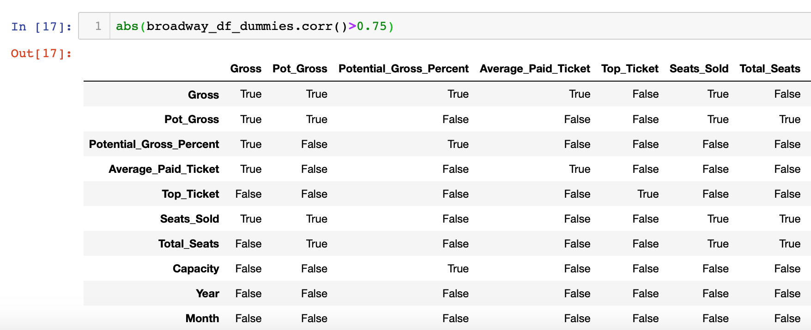

* Second dummy variable is `Type`- Whether it is a "Musical" or a "Play":
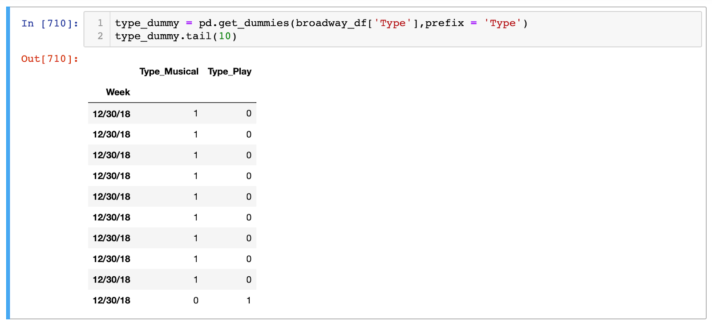

I wanted to see what the R2 looks like with all of the original independent variables in the dataset:
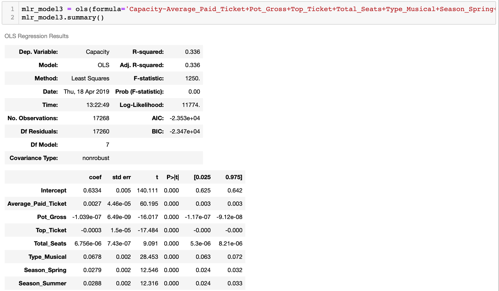

   * OLS gave me a R2 of 0.336, an improvement. 

## Checking Residuals and Testing Model 2.0

* Using a QQ-plot of my residuals, it's evident that there's a clear deviation from normality:
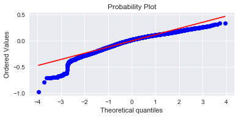

I decided to test the model nonethless: 

* I picked a random data point:
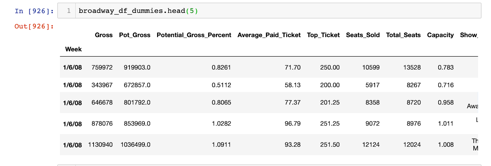

* I inputted the values from that data point into my model:
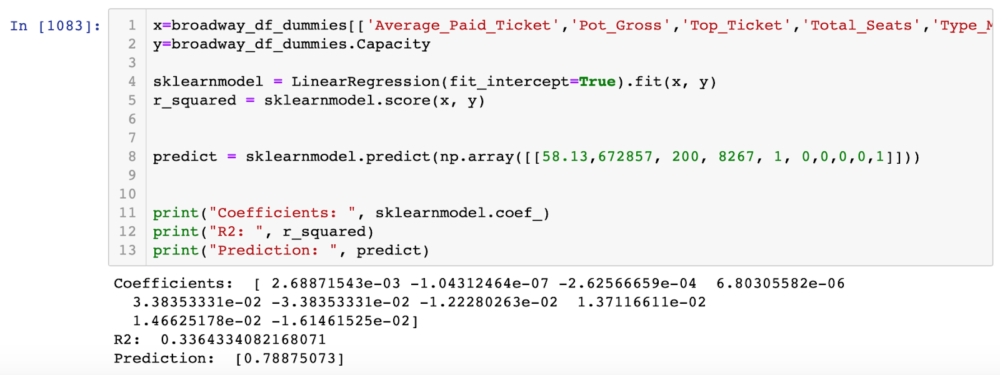

* The predicted `Capacity` was 0.788, whereas the actual `Capacity` was 0.716. Not bad, but I wanted to see if the model can be improved overall. 

## Normalizing and Scaling The Data

* I checked to see if the data of the independent variables was "normal". As you can see below, only `Potential Gross` is "normal".
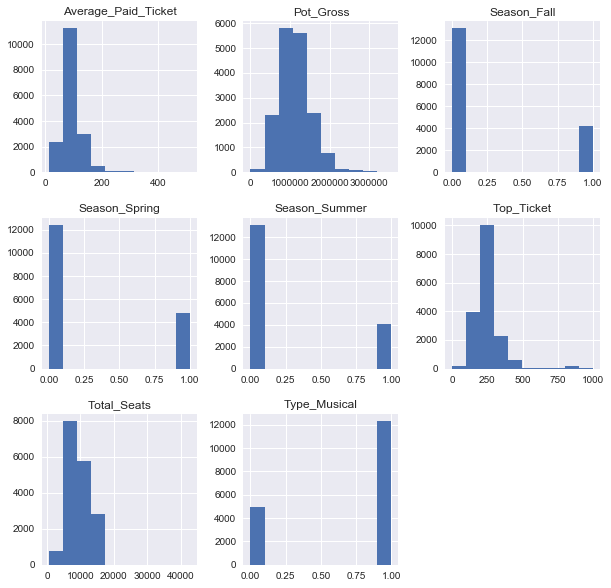

* So I scaled and normalized the data for the remainder of the independent variables:
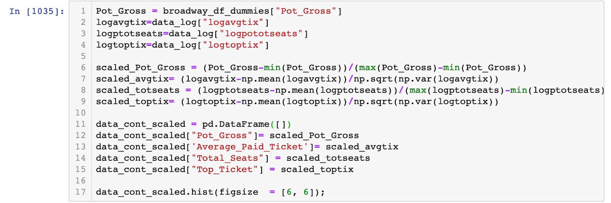
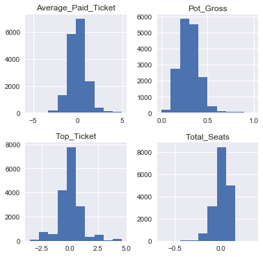

## Model 3.0

* Using a QQ-plot of the residuals once again, there's less deviation from normality:
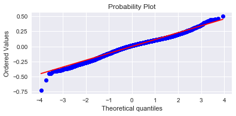

* Now putting the normalized indepedent variables into a new model, OLS gave me a R2 of 0.411. This is as high as I was able to get it.
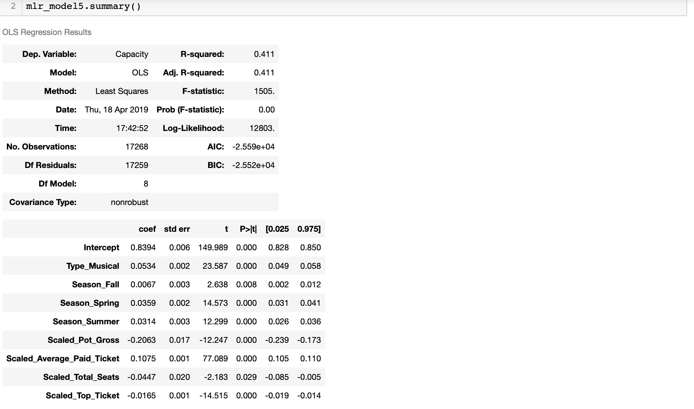

## Interperting The Model

In model 3.0, ~41.1% of the variability in the `Capacity` can be explained by the following variables:

* If the show is a Musical, `Capacity` goes up by 0.05.
* If the show is is playing during the Fall, `Capacity` goes up by 0.006.
* If the show is is playing during the Spring, `Capacity` goes up by 0.035.
* If the show is is playing during the Summer, `Capacity` goes up by 0.031.
* For every 1 point increase in `Potential Gross`, `Capacity` goes up DOWN by 0.21.
* For every 1 point increase in `Average Paid Ticket`, `Capacity` goes up up by 0.10.
* For every 1 point increase in `Total Seats`, `Capacity` goes up DOWN by 0.04.
* For every 1 point increase in `Top Ticket Sold`, `Capacity` goes up DOWN by 0.04.

