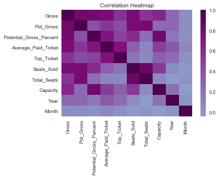
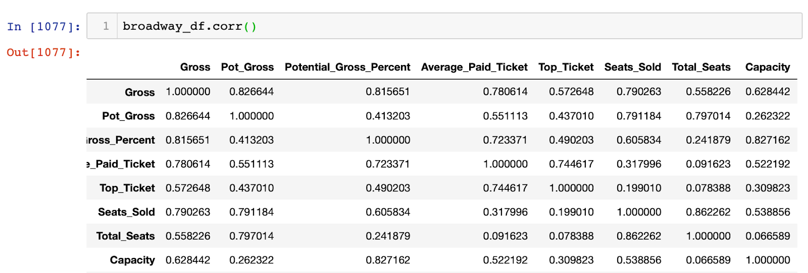
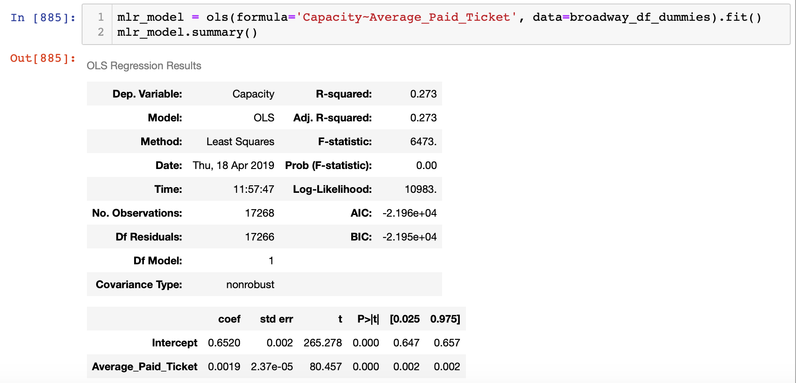

# Mod 2 Project- Broadway Grosses

Link to presentation slideshow: https://docs.google.com/presentation/d/1beP4vmAZb8woGX66PM23OxgjV7xkgTauPFcvcqPEUYM/edit?usp=sharing

## Project Goals

* Create a model that will predict the success of a Broadway show, and figure out what possible attribute contribute to that success. 

## Data

* First used a CSV data set of weekly box office reports from 1993-2006.
* Decided to create my own data set.
* Web-Scraped weekly box office reports from https://www.broadwayworld.com/.
* Final data from over 1,200 broadway shows in a span of 35 years. 

## Data Cleaning

* Narrowing the data to a period of 10 years (2008-2018):

* Cleaning up missing data:

Luckily the data from 2008-2018 was consistently reliable, so there wasn't too much data clenaing to be done.

* Creating new column for new variable (Season):

I wanted to see if seasonality affects the success of the show. 

## Initial Observations

From a first glance at the pairwise plot, it's hard to point out distinct relationships between the columns. 

So next step is to take a closer look at correlations:

* First, a correlation heat map

* Second, a correlation table

- What is clearly noticeable is that `Capacity` is highly correlated with `Percentage of Potential Gross` (Actual Gross/Potential Gross), which is the biggest indicator to a show's success. 

- Also noticeable, `Average Ticket Price` is decently correlated with Capacity. 

## Picking A Target Variable

Based on the intial observations, since Capacity is highly correlated with `Percentage of Potential Gross`,
predicting it will help predicting the success of a show. Therefore, `Capacity` will be the target variable for the models.

What exactly is Capacity?

* `Capacity`- The percentage of the theatre that was filled during that week (seats Sold / total Seats).

The model aims to predict the success of a possible Broadway show. The independent variables in the model consist of the following:

* `Gross Potential`- The maximum amount an engagement can possibly earn based on calculations involving ticket prices, seating capacity, and the number of performances. 
* `Average Paid Ticket`
* `Top Ticket Sold`
* `Total Seats` 
* `Type`- Whether it is a "Musical" or a "Play".
* `Season`- Whether the show is playing during the "Fall", "Winter", "Spring" or "Summer".

## Starting Off With A Simple Regression Model
I wanted to see what the R2 looks like with with just `Average Paid Ticket` in the dataset, since it's the most correlated with `Capacity`:

* OLS gave me a R2 of 0.273, obviously this is not very high.

